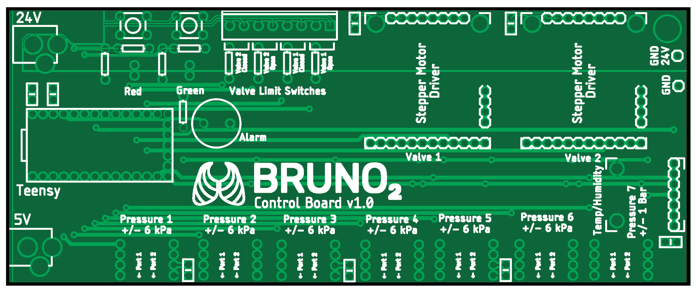

# BrunO2 Ventilator Electronic Hardware Components

---
These open source ventilator design materials are provided under the conditions specified in the [Permissive License](../../Permissive%20License--Brown%20University%20041720.pdf)

---
# BrunO2 PCB v1
## 

[PDF Schematic](PCB_v1/BrunO2%20PCB%20Schematic%20v1.pdf)

[Eagle Schematic](PCB_v1/BrunO2_ControlBoard_v1.sch)

[Eagle Layout](PCB_v1/BrunO2_ControlBoard_v1.brd)

[Gerber Files](PCB_v1/BrunO2_ControlBoard_v1_Gerbers_2020-04-05.zip)

---
# XXXX
## YYYY